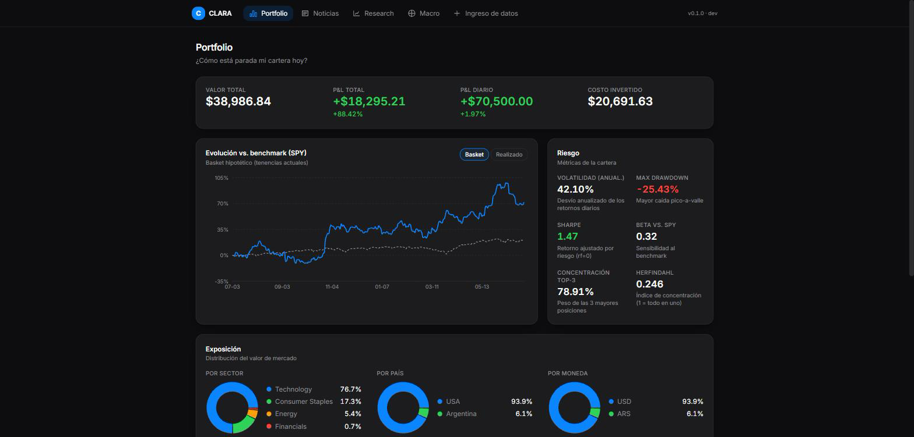
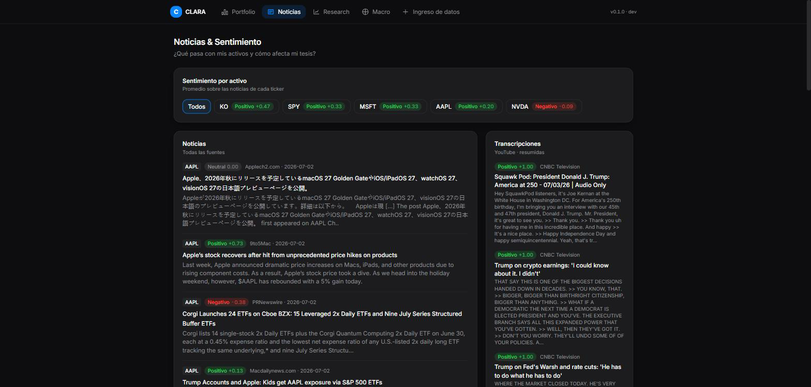
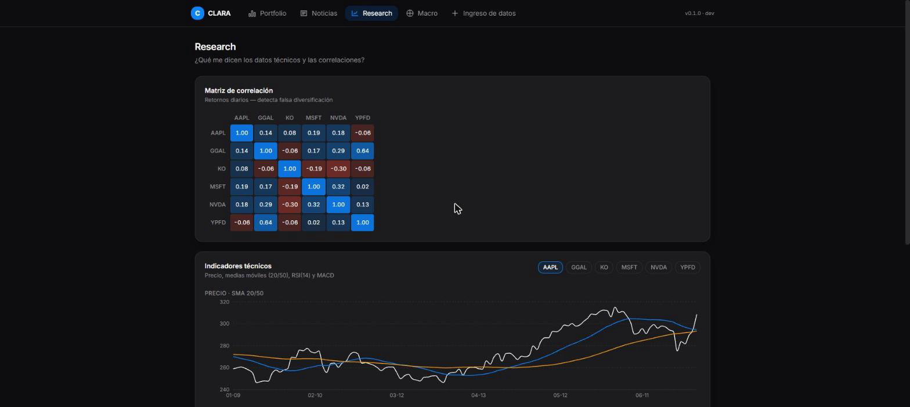
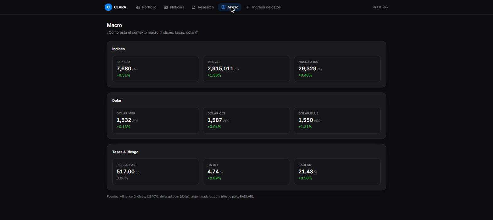
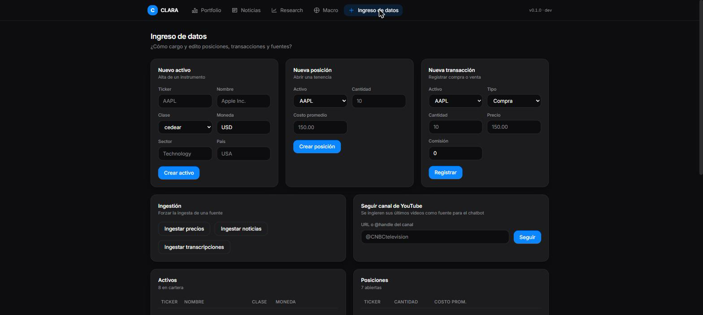

# CLARA — Cartera, Lectura, Análisis, Riesgo y Acción

> Una **mesa de análisis de portfolio** local. No un tracker de saldos: una
> herramienta que cruza tus posiciones con métricas de riesgo, noticias,
> sentimiento, macro y transcripciones de analistas, para responder rápido las
> preguntas que un inversor realmente se hace.

CLARA está construida como pieza de portfolio profesional: demuestra **data
engineering** (arquitectura medallion, data quality, ingestión idempotente) y
**análisis de datos** (métricas financieras testeadas y verificadas a mano) al
mismo tiempo, con una UI dark/minimalista con fundamentos de iOS.

---

## El problema

La información de mis activos vivía dispersa: el precio en un lado, la noticia
en otro, el análisis del que sigo en YouTube en un tercero, y el riesgo real de
mi cartera —volatilidad, drawdown, concentración, correlaciones— en ningún lado.
Perdía contexto y, a veces, oportunidades. CLARA junta todo eso en una sola
superficie y hace las cuentas que importan, con tests que prueban que están bien.

## La solución: seis pestañas, cada una responde una pregunta

| Pestaña | Pregunta que responde |
|---|---|
| **Portfolio** | ¿Cómo está parada mi cartera hoy? Valor, P&L, riesgo, vs. benchmark. |
| **Noticias & Sentimiento** | ¿Qué pasa con mis activos y cómo afecta mi tesis? |
| **Research** | ¿Estoy realmente diversificado? ¿Qué dice el técnico? |
| **Macro** | ¿Cómo está el contexto (índices, dólar, riesgo país, tasas)? |
| **Screener** | ¿Qué candidatos hay más allá de lo que ya tengo cargado? |
| **Ingreso de datos** | ¿Cómo cargo y edito posiciones y fuentes? |

> **Capturas:** ver `docs/screenshots/` y la bitácora narrativa por fase en
> `docs/devlog/`.

### Capturas

| Portfolio | Noticias & Sentimiento |
|---|---|
|  |  |

| Research | Macro |
|---|---|
|  |  |

| Ingreso de datos |
|---|
|  |

## La arquitectura (por qué está pensada, no improvisada)

```
FUENTES            INGESTIÓN              ALMACENAMIENTO         SERVING
yfinance      ┐                           BRONZE (crudo)         API REST
News API      ├─▶  clients (mock)    ──▶  SILVER (limpio)   ──▶  (FastAPI)  ──▶  React
YouTube       │   + data quality          GOLD (métricas)
macro / FX    ┘   + cuarentena
```

- **Medallion (bronze → silver → gold):** el dato crudo se guarda tal cual
  (reprocesable sin volver a la fuente); silver son las entidades limpias y
  tipadas con claves naturales `UNIQUE` (ingestión idempotente); gold son las
  métricas agregadas.
- **Data quality con cuarentena:** checks declarativos (precio > 0, fecha no
  futura, ticker existe, sentimiento ∈ [-1, 1]) corren antes de promover a
  silver. Lo que falla va a una tabla `quarantine` con el motivo — **nunca se
  descarta en silencio**.
- **Capa de servicio:** único puente entre la base y la capa de analytics. Los
  routers quedan finos; analytics queda puro (funciones sin DB, triviales de
  testear).
- **SQLite en dev → Postgres en prod:** mismo esquema, solo cambia el connection
  string. Migraciones con Alembic.

Decisiones de diseño documentadas como ADRs en `docs/adr/`.

## Lo que más puntúa: las métricas están testeadas y verificadas a mano

Cada función de cálculo financiero tiene un test cuyo valor esperado fue
**calculado por fuera** (no contra la propia función): rendimiento total y
time-weighted, volatilidad anualizada, max drawdown, Sharpe, beta, exposición,
concentración Herfindahl, correlaciones, SMA y RSI. Más un test de integración
sobre datos reales del seed (`beta(SPY, SPY) ≈ 1` como canario de alineación
temporal).

```
backend: 151 tests (pytest)      frontend:  23 tests (vitest)
```

## Stack

- **Backend:** Python 3.11+, FastAPI, SQLAlchemy 2.0, Pydantic, Alembic,
  APScheduler, pandas/numpy, VADER (sentimiento).
- **Frontend:** React + Vite + TypeScript + Tailwind + Recharts.
- **DB:** SQLite (dev) / Postgres (prod, vía Docker).

## Cómo correrlo

### Backend
```bash
cd backend
python -m venv venv
venv\Scripts\activate                 # Windows  (bash: source venv/Scripts/activate)
pip install -r requirements.txt
alembic upgrade head                  # crea el esquema medallion
python -m app.storage.seed_cli        # portfolio de ejemplo + precios/noticias (mock)
uvicorn app.main:app --reload         # http://127.0.0.1:8000  (Swagger en /docs)
```

### Frontend
```bash
cd frontend
npm install
npm run dev                           # http://localhost:5180
```

### Tests
```bash
cd backend  && venv\Scripts\python -m pytest
cd frontend && npm test
```

### Postgres (prod, opcional)
```bash
docker compose up -d                  # levanta Postgres 16
# luego, con DATABASE_URL apuntando a Postgres:
cd backend && alembic upgrade head && python -m app.storage.seed_cli
```

## Fuentes de datos

- **Precios:** yfinance (datos reales de mercado).
- **Noticias:** NewsAPI (requiere API key en `.env`).
- **Macro:** yfinance (índices, US 10Y) + dolarapi.com (dólar MEP/CCL/Blue) +
  argentinadatos.com (riesgo país, BADLAR).
- **Transcripciones:** mock determinístico (youtube-transcript-api listo para
  enchufar con API key).
- **Chatbot IA:** Groq (Llama 3.3 70B) como provider prioritario, con fallback
  a Qwen → Gemini → Anthropic → análisis estático. Sin API key funciona igual
  con análisis regla-base.

Cada fuente sigue el patrón `fetch → bronze → validar → promover`. El modo mock
está disponible con `USE_MOCK_SOURCES=true` para desarrollo sin red.

## Estado del proyecto

- [x] **Fase 0 — Scaffold** · app corre de punta a punta, theme aplicado.
- [x] **Fase 1 — Capa de datos** · medallion + data quality + cuarentena + seed.
- [x] **Fase 2 — Analytics** · métricas verificadas a mano (47 tests).
- [x] **Fase 3 — API** · service layer + routers + test de integración.
- [x] **Fase 4 — Portfolio** · dashboard principal con datos reales.
- [x] **Fase 5 — Ingreso de datos** · CRUD end-to-end + ingestión idempotente.
- [x] **Fase 6 — Noticias & Sentimiento** · ingestión + VADER + pestaña.
- [x] **Fase 7 — Research & Macro** · correlación, indicadores, macro.
- [x] **Fase 8 — Pulido** · scheduler, Docker, README, cierre.
- [x] **Fase 9 — Chatbot IA** · análisis fundamental por activo + página de detalle.
- [x] **Fase 10 — Datos reales** · yfinance, NewsAPI, dolarapi enchufados.
- [x] **Fase 11 — Ingestion conectada** · pipeline real end-to-end + chatbot con fallback.
- [x] **Chatbot multi-provider** · Groq (Llama 3.3) → Qwen → Gemini → Anthropic → estático.
- [x] **Comparador de activos** · métricas lado a lado en Research.
- [x] **CI/CD** · GitHub Actions (pytest + tsc + vitest).

## Qué aprendí

- **Verificar a mano paga:** mi primer test de Sharpe falló por un error *mío* en
  la multiplicación del comentario, no en la función. Un test contra la propia
  función nunca lo habría atrapado.
- **El dato sucio no se tira, se audita:** la cuarentena convirtió "validación"
  en "observabilidad del pipeline".
- **Honestidad de alcance:** mock declarado + ADR que explica el camino real vale
  más que un gráfico bonito que no significa nada.
- **Multi-provider LLM con fallback:** diseñar la cadena Groq → Qwen → Gemini →
  Anthropic → estático hace que el chatbot siempre funcione, con o sin keys.

---

*Bitácora de desarrollo en `docs/devlog/` · decisiones de arquitectura en
`docs/adr/` · resumen final en `docs/devlog/RESUMEN.md`.*
